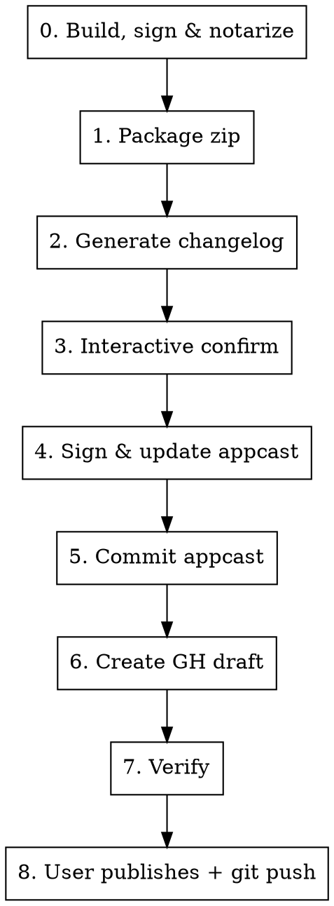

# Release Preparation

Full release pipeline: bump version → build → sign → notarize → package zip → generate changelog → sign appcast → create GH draft.

## Inputs

| Input | Source |
|-------|--------|
| Mos.app | Built via xcodebuild archive + Developer ID export (Step 0) |
| Version / Build | `MARKETING_VERSION` / `CURRENT_PROJECT_VERSION` in `Mos.xcodeproj/project.pbxproj` |
| Channel | User specifies: `stable`, `beta`, or `alpha` |
| Signing key | macOS Keychain — Apple Developer ID (code signing) + Sparkle EdDSA (appcast) |
| Notarization | macOS Keychain profile `notarytool` (stores Apple ID + app-specific password) |

## Flow



### Step 0: Build, Sign & Notarize

1. **Bump version** in `Mos.xcodeproj/project.pbxproj`:
   - `MARKETING_VERSION` — e.g., `4.0.2` (appears twice, use `replace_all`)
   - `CURRENT_PROJECT_VERSION` — build number in `YYYYMMDD.N` format (appears twice, use `replace_all`).
     **CRITICAL**: Every release MUST have a unique `CURRENT_PROJECT_VERSION`. Sparkle uses this value (`sparkle:version`) to detect updates — if two releases share the same build number, users on the older version will never see the update. Always bump this even for hotfix releases.
   - Commit the version bump.

2. **Archive**:
   ```bash
   xcodebuild archive \
     -scheme Debug \
     -project Mos.xcodeproj \
     -configuration Release \
     -archivePath /tmp/Mos.xcarchive
   ```
   Note: The scheme is named "Debug" but `-configuration Release` ensures Release build settings.

3. **Export with Developer ID** (Direct Distribution):
   ```bash
   cat > /tmp/ExportOptions.plist << 'PLIST'
   <?xml version="1.0" encoding="UTF-8"?>
   <!DOCTYPE plist PUBLIC "-//Apple//DTD PLIST 1.0//EN" "http://www.apple.com/DTDs/PropertyList-1.0.dtd">
   <plist version="1.0">
   <dict>
     <key>method</key><string>developer-id</string>
     <key>teamID</key><string>N7Z52F27XK</string>
     <key>signingStyle</key><string>automatic</string>
   </dict>
   </plist>
   PLIST

   xcodebuild -exportArchive \
     -archivePath /tmp/Mos.xcarchive \
     -exportOptionsPlist /tmp/ExportOptions.plist \
     -exportPath /tmp/MosExport \
     -allowProvisioningUpdates
   ```
   If export fails with "network connection was lost", retry — Apple's notarization service can be flaky.

4. **Notarize** (`xcodebuild -exportArchive` does NOT auto-notarize via CLI — must always do manually):
   ```bash
   # Note: this zip is only for notarization submission, not for distribution.
   # AppleDouble flags (--norsrc --noextattr) are not needed here — only in prepare_zip.sh for the release zip.
   ditto -c -k --keepParent /tmp/MosExport/Mos.app /tmp/Mos-notarize.zip
   xcrun notarytool submit /tmp/Mos-notarize.zip --keychain-profile "notarytool" --wait
   xcrun stapler staple /tmp/MosExport/Mos.app
   ```

5. **Verify**:
   ```bash
   codesign -dvv /tmp/MosExport/Mos.app 2>&1 | grep Authority
   # Should show: Developer ID Application: BIAO CHEN (N7Z52F27XK)
   spctl --assess --type execute --verbose /tmp/MosExport/Mos.app
   # Should show: accepted, source=Notarized Developer ID
   ```

The notarized app at `/tmp/MosExport/Mos.app` is used for Step 1.

### Step 1: Package Zip

```bash
bash .skills/release-preparation/scripts/prepare_zip.sh /tmp/MosExport/Mos.app [--channel beta]
```

Returns JSON with `zip_path`, `version`, `build`, `tag`, `zip_name`, `length`.

**IMPORTANT — AppleDouble / Gatekeeper**: The script uses `ditto -c -k --norsrc --noextattr --keepParent` to create the zip. The `--norsrc --noextattr` flags are **mandatory** — without them, `ditto` serializes macOS extended attributes as AppleDouble (`._*`) files inside the zip. When users extract via Finder/Archive Utility (not `ditto -x -k`), these `._*` entries appear as real files in embedded framework root directories (e.g., `Sparkle.framework/._Autoupdate`), causing Gatekeeper to reject with "unsealed contents present in the root directory of an embedded framework". This issue is **not detectable** by `spctl --assess` on the build machine because `ditto -x -k` correctly reconverts `._*` files back to xattrs — only Finder extraction triggers the failure.

After packaging, verify the zip is clean:
```bash
# Must show NO ._* entries
zipinfo -1 "$ZIP_PATH" | grep '/\._' && echo "ERROR: AppleDouble files found!" || echo "OK: no AppleDouble files"
```

### Step 2: Generate Changelog

**This is AI work, not scripted.** Follow these rules:

1. Find last release tag:
   ```bash
   gh release list --repo Caldis/Mos --limit 1 --json tagName,isPrerelease
   git rev-parse <tag>  # get exact commit SHA
   ```
2. Get changes: `git log <last_tag>..HEAD --no-merges --oneline` excluding `website/`, `docs/`, `.issues-archive/`, `CLAUDE.md`, `LOCALIZATION.md`, `build/`, `dmg/`, `CRASH_FIX_DESIGN*`.
3. Categorize into: 新功能/New Features, 优化/Improvements, 修复/Fixes.
4. Find contributors: cross-reference `git log --format="%an"` with `gh api repos/.../commits/<sha> --jq '.author.login'`. Inline credit in the relevant section (e.g., "修复鼠标中键映射问题, 感谢 @GonzFC"), NOT in a separate section.
5. Match tone of `CHANGELOG.md` — bilingual (Chinese first, `---` separator, then English).
6. Write both formats:
   - **Markdown** → `~/Desktop/release-notes-{version}.md` (for GH release body). Must include wiki links header before each language section:
     ```markdown
     > 如果应用无法启动或遇到权限问题, 请参考 [Wiki: 如果应用无法正常运行](https://github.com/Caldis/Mos/wiki/%E5%A6%82%E6%9E%9C%E5%BA%94%E7%94%A8%E6%97%A0%E6%B3%95%E6%AD%A3%E5%B8%B8%E8%BF%90%E8%A1%8C)

     ## 修复
     - ...

     ---

     > If the application fails to start or encounters permission issues, please refer [Wiki: If the App not work properly](https://github.com/Caldis/Mos/wiki/If-the-App-not-work-properly)

     ## Fixes
     - ...
     ```
   - **HTML** → `/tmp/changelog-{version}.html` (for appcast CDATA). Use `<h2>` + `<ul><li>`, with `<hr/>` separating Chinese and English:
     ```html
     <h2>修复</h2>
     <ul>
     <li>修复平滑滚动导致的崩溃问题</li>
     </ul>

     <hr/>

     <h2>Fixes</h2>
     <ul>
     <li>Fix crash caused by smooth scrolling</li>
     </ul>
     ```

### Step 3: Interactive Confirm

**MUST use `AskUserQuestion`** to confirm changelog items. Never list items as text and ask user to type numbers.

After confirmation, sync any user edits from markdown back to HTML. Always keep both formats in sync.

### Step 4: Sign & Update Appcast

```bash
bash .skills/release-preparation/scripts/update_appcast.sh <zip_path> /tmp/changelog-{version}.html [--tag TAG]
```

Uses Sparkle `sign_update` from Xcode DerivedData (reads EdDSA key from Keychain). If key missing, guide user:
```bash
# Find generate_keys tool
find ~/Library/Developer/Xcode/DerivedData -name "generate_keys" -not -path "*/checkouts/*" | head -1
# Import: generate_keys -f <key_file>
# Export: generate_keys -x <output_file>
```

The script writes to both `build/appcast.xml` and `docs/appcast.xml`.

### Step 5: Commit Appcast

Only `docs/appcast.xml` is tracked by git (`build/` is gitignored):
```bash
git add docs/appcast.xml
git commit -m "chore: update appcast for {version}"
```

### Step 6: Create GitHub Draft

```bash
bash .skills/release-preparation/scripts/create_gh_draft.sh <tag> <zip_path> ~/Desktop/release-notes-{version}.md [--prerelease]
```

Add `--prerelease` for beta/alpha channels. This creates a **draft** — never publish without user approval.

### Step 7: Verify

```bash
gh release view <tag> --repo Caldis/Mos --json tagName,isDraft,assets \
  --jq '{tag: .tagName, draft: .isDraft, assets: [.assets[] | {name: .name, size: .size}]}'
```

Confirm asset URL matches appcast `<enclosure url="...">`.

### Step 8: User Publishes

User reviews draft on GitHub and publishes. After publishing:
```bash
git push origin master
```
This pushes the appcast update so Sparkle auto-update can find it.

## Naming Conventions

| | Stable | Beta/Alpha |
|---|---|---|
| Zip | `Mos.Versions.{ver}-{YYYYMMDD.N}.zip` | `Mos.Versions.{ver}-beta-{YYYYMMDD.N}.zip` |
| Tag | `{ver}` | `{ver}-beta-{YYYYMMDD.N}` |
| Download URL | `.../download/{ver}/Mos.Versions...zip` | `.../download/{ver}-beta-.../Mos.Versions...zip` |

## Common Issues

| Problem | Fix |
|---------|-----|
| Export fails with "network connection was lost" | Retry — Apple notarization service can be intermittent |
| `spctl --assess` rejected after export | Notarization not auto-applied; manually submit with `notarytool` + `stapler staple` |
| `sign_update` not found | Build project in Xcode first to fetch Sparkle SPM package |
| Signing key not in Keychain | Use `generate_keys -f <key_file>` to import Sparkle EdDSA key |
| Developer ID cert missing from `security find-identity` | Download from Apple Developer portal or use Xcode → Settings → Accounts → Manage Certificates |
| Appcast URL mismatch | Verify GH release tag matches appcast `<enclosure>` URL path |
| Changelog out of sync | Always edit markdown first, then regenerate HTML before updating appcast |
| Sparkle update not detected | Each release MUST have a unique `CURRENT_PROJECT_VERSION` (= `sparkle:version`). Sparkle compares this value, not `MARKETING_VERSION`. If two releases share the same build number, users will never see the update. |
| Gatekeeper rejects downloaded app ("Apple 无法验证") | Zip likely contains AppleDouble `._*` files. Verify with `zipinfo -1 <zip> \| grep '/\._'`. Fix: use `ditto -c -k --norsrc --noextattr --keepParent` (already in `prepare_zip.sh`). Note: `spctl --assess` on build machine won't catch this — only Finder extraction triggers failure. |
| `COPYFILE_DISABLE=1` doesn't work with `ditto` | This env var only works with `cp`, `tar`, etc. For `ditto`, use `--norsrc --noextattr` flags instead. |
