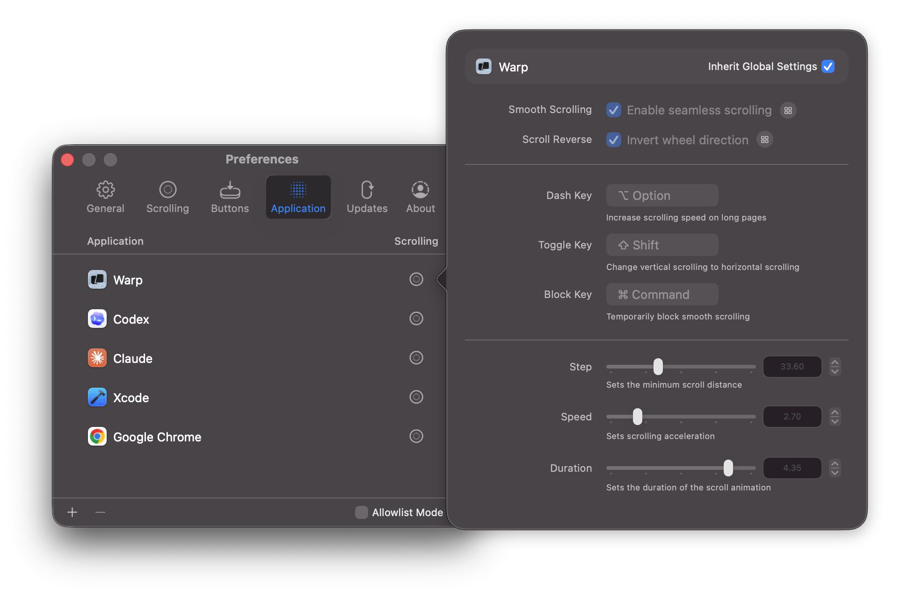
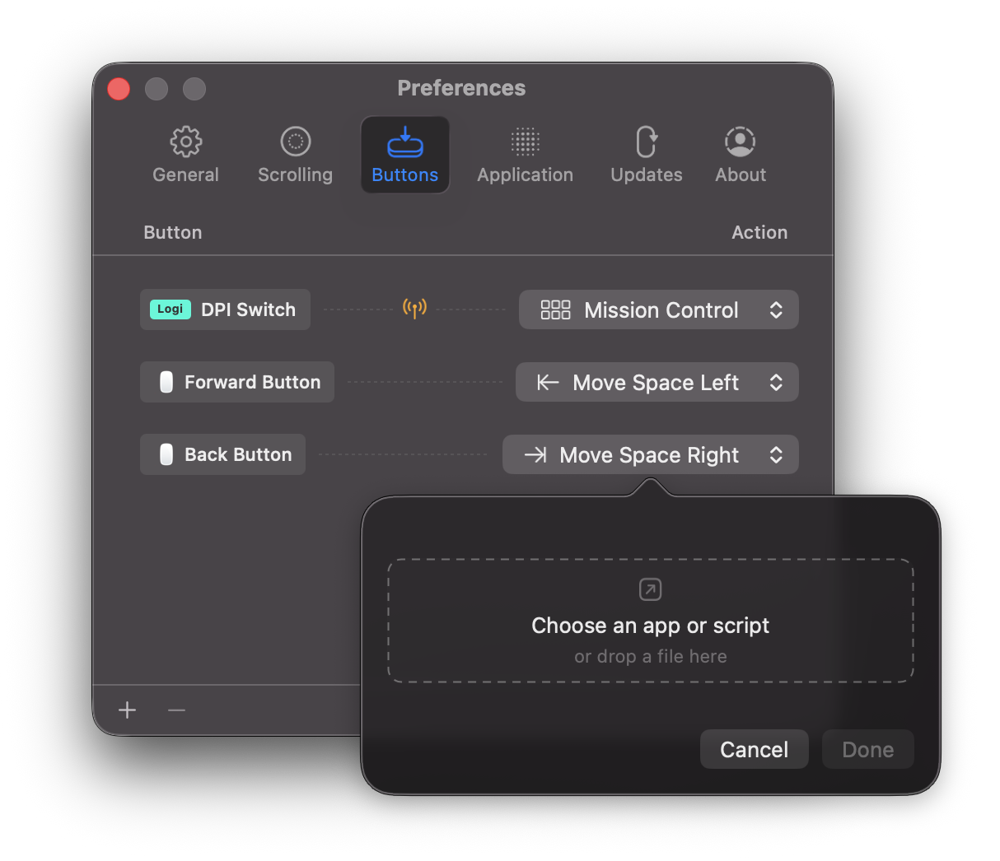
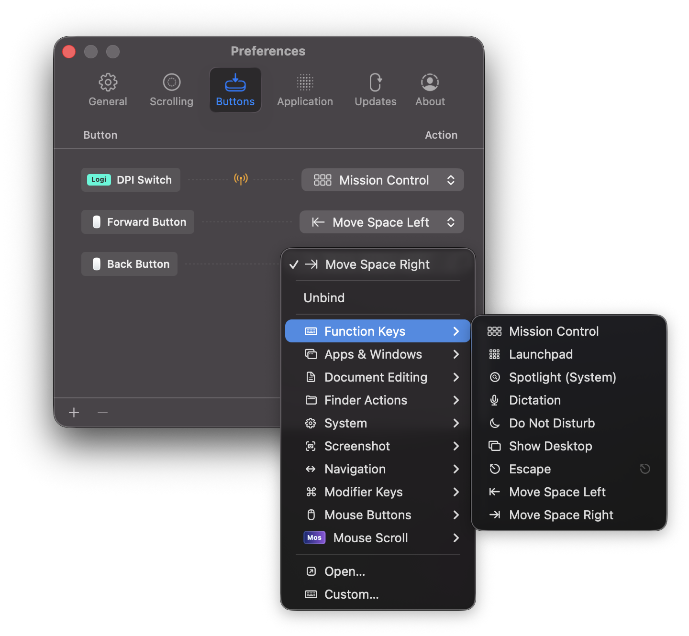

<p align="center">
  <a href="https://mos.caldis.me/">
    
  </a>
</p>

<h1 align="center">Mos</h1>

<p align="center">
  macOS의 마우스 휠 스크롤을 트랙패드처럼 부드럽게 만들면서, 마우스다운 정밀한 제어감은 그대로 유지합니다.
</p>

<p align="center">
  <a href="https://github.com/Caldis/Mos/releases"></a>
  
  
  <a href="LICENSE"></a>
</p>

<p align="center">
  <a href="README.md">中文</a> ·
  <a href="README.enUS.md">English</a> ·
  <a href="README.de.md">Deutsch</a> ·
  <a href="README.ja.md">日本語</a> ·
  <a href="README.ko.md">한국어</a> ·
  <a href="README.ru.md">Русский</a> ·
  <a href="README.id.md">Bahasa Indonesia</a>
</p>

<p align="center">
  <a href="https://mos.caldis.me/">홈페이지</a> ·
  <a href="https://github.com/Caldis/Mos/releases">다운로드</a> ·
  <a href="https://github.com/Caldis/Mos/wiki">Wiki</a> ·
  <a href="https://github.com/Caldis/Mos/discussions">Discussions</a>
</p>

<p align="center">
  
</p>

## 왜 Mos인가요

macOS에서 일반 마우스 휠 스크롤은 종종 딱딱하게 느껴집니다. 휠의 정밀도가 부족해 트랙패드처럼 연속적이고 예측 가능한 관성이 잘 나오지 않기 때문입니다. Mos는 마우스 휠 이벤트를 받아 원시 델타 값을 더 부드러운 스크롤로 변환하면서도 앱, 방향, 버튼별 제어권을 유지합니다.

또한 Mos를 사용해 원하는 마우스 버튼을 다시 매핑하거나 동작을 바꿔 자신의 워크플로에 맞출 수 있습니다.

Mos는 macOS 10.13 이상을 지원하는 무료 오픈소스 메뉴 막대 유틸리티입니다.

## 주요 기능

- **부드러운 스크롤**: 최소 단계, 속도 게인, 지속 시간을 조정하거나 트랙패드 시뮬레이션 모드를 켤 수 있습니다.
- **축별 독립 설정**: 세로 및 가로 스크롤의 부드러움과 반전 방향을 각각 설정할 수 있습니다.
- **스크롤 단축키**: 가속, 방향 전환, 부드러운 스크롤 임시 비활성화에 원하는 키를 지정할 수 있습니다.
- **앱별 프로필**: 각 앱이 전역 설정을 상속하거나 스크롤, 단축키, 버튼 바인딩 동작을 개별적으로 덮어쓸 수 있습니다.
- **버튼 바인딩**: 마우스, 키보드 또는 사용자 지정 이벤트를 기록한 뒤 시스템 동작, 단축키, 앱 실행, 스크립트 실행, 파일 열기에 연결할 수 있습니다.
- **동작 라이브러리**: Mission Control, Spaces, 스크린샷, Finder 작업, 문서 편집, 마우스 스크롤 등 기본 제공 동작을 사용할 수 있습니다.
- **Logi/HID++ 지원**: Bolt, Unifying 수신기, Bluetooth 직접 연결 기기의 Logitech 버튼 이벤트를 처리하며 Logi 전용 동작도 지원합니다.

## 스크린샷

| 스크롤 조정 | 앱별 프로필 |
| --- | --- |
|  |  |

| App, 스크립트 또는 파일 열기 | 동작 라이브러리 |
| --- | --- |
|  |  |

## 다운로드 및 설치

### 수동 설치

[GitHub Releases](https://github.com/Caldis/Mos/releases)에서 최신 빌드를 다운로드하고 압축을 푼 뒤 `Mos.app`을 `/Applications`로 옮기세요.

처음 실행할 때 macOS가 Mos에 대한 손쉬운 사용 권한을 요청할 수 있습니다. Mos는 스크롤 이벤트를 읽고 다시 쓰기 위해 이 권한이 필요합니다. 권한을 부여한 뒤에도 앱이 작동하지 않으면 [권한 문제 해결 가이드](https://github.com/Caldis/Mos/wiki/If-the-App-not-work-properly)를 참고하세요.

### Homebrew

Homebrew로 앱을 관리한다면:

```bash
brew install --cask mos
```

업데이트:

```bash
brew update
brew upgrade --cask mos
```

## 기여

Mos는 시스템 입력, 손쉬운 사용 권한, Logi/HID 장치, 저장된 사용자 설정을 다루는 작은 유틸리티입니다. 유지보수 비용과 회귀 위험은 실제로 존재하므로, 작고 초점이 분명한 변경을 강하게 선호합니다.

Logi/HID, 손쉬운 사용 권한, 서명, notarization, 앱 업데이트, 실제 장치 테스트를 건드리는 변경은 위험도가 높습니다. 해당 영역의 큰 PR을 열기 전에 issue 또는 Discussions에서 배경을 먼저 설명해 주세요.

PR 설명에는 변경 동기, 검증 방법, 가능한 동작 영향 범위를 적어 주세요.

> AI가 작성한 코드는 이미 일반적인 일이 되었고, 많은 PR이 AI 도움을 받아 만들어진다는 점도 이해합니다. 우리 작업도 예외는 아닙니다. 하지만 제출자는 변경된 모든 줄이 실제로 무엇을 하는지 이해하고, 정리하고, 검증해야 합니다. 모든 PR 리뷰에는 비용이 들기 때문입니다.

### 적극 환영합니다

- 재현 단계나 검증 메모가 있는 작은 버그 수정.
- 레이아웃, 문구, 가독성, 온보딩 같은 UI/UX 세부 개선.
- 더 안전한 권한 상태 처리, 입력 보호, 경계 검사 같은 작은 보안 강화.
- 로컬라이제이션, 문서, 테스트 개선.
- 단일 주제이며 변경 줄 수가 적고 리뷰 범위가 명확한 PR.

### 현재는 병합하지 않습니다

- 사전 논의가 없는 대형 신규 기능, 모듈, 아키텍처 재작성.
- 대량 AI 생성 리라이트, 포맷 정리, 마이그레이션, 부수적인 정리 작업.
- 입력 이벤트 처리, 권한 프롬프트, 앱 업데이트, 기존 사용자 데이터 읽기, 저장 형식에 영향을 주는 동작 변경.
- 원어민 검토가 어려운 대규모 기계 번역 세트.

모든 형태의 기여를 환영합니다. 제안이나 피드백이 있다면 [issue](https://github.com/Caldis/Mos/issues)를 열어 주세요.

새 기능에 관심이 크다면 먼저 [Discussions](https://github.com/Caldis/Mos/discussions)에서 시작해 주세요.

## 감사

- [Charts](https://github.com/danielgindi/Charts)
- [LoginServiceKit](https://github.com/Clipy/LoginServiceKit)
- [Sparkle](https://github.com/sparkle-project/Sparkle)
- [Smoothscroll-for-websites](https://github.com/galambalazs/smoothscroll-for-websites)
- [Solaar](https://github.com/pwr-Solaar/Solaar)

## License

Copyright (c) 2017-2026 Caldis. All rights reserved.

Mos는 [CC BY-NC 4.0](http://creativecommons.org/licenses/by-nc/4.0/) 라이선스를 따릅니다. Mos를 App Store에 업로드하지 마세요.
