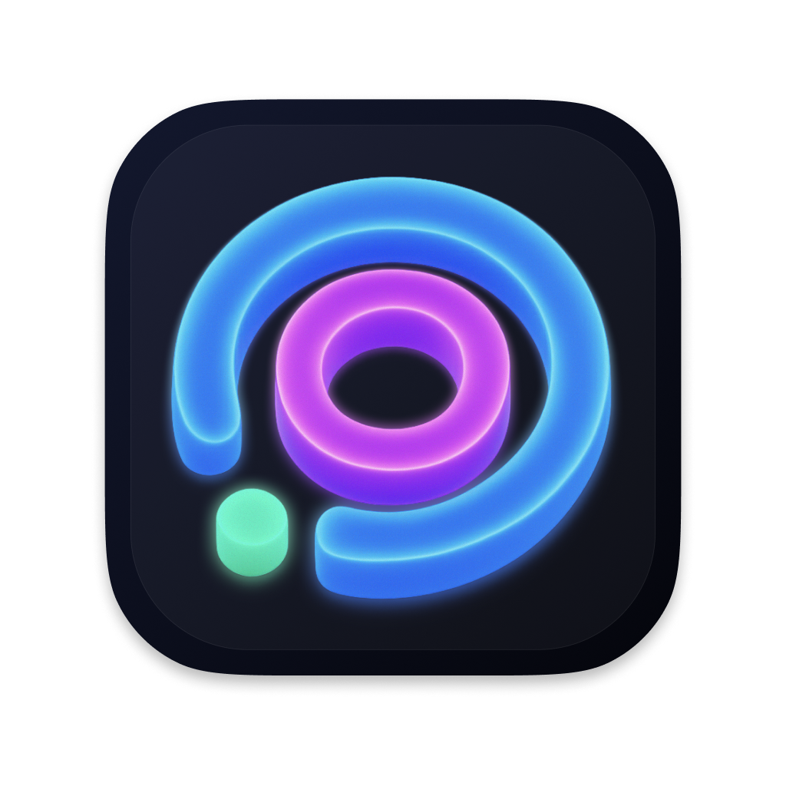
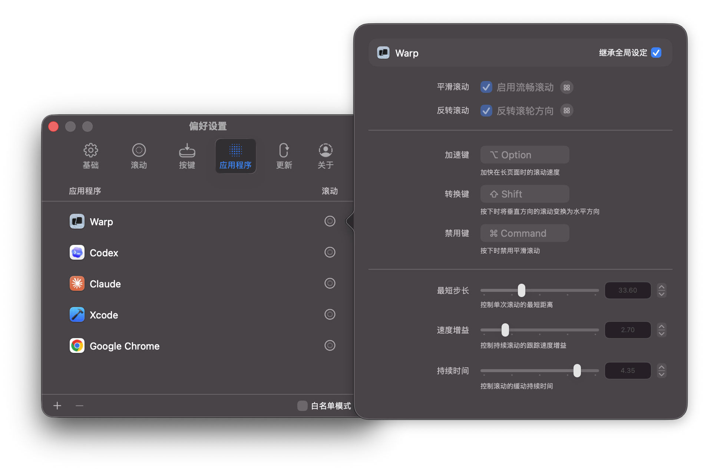
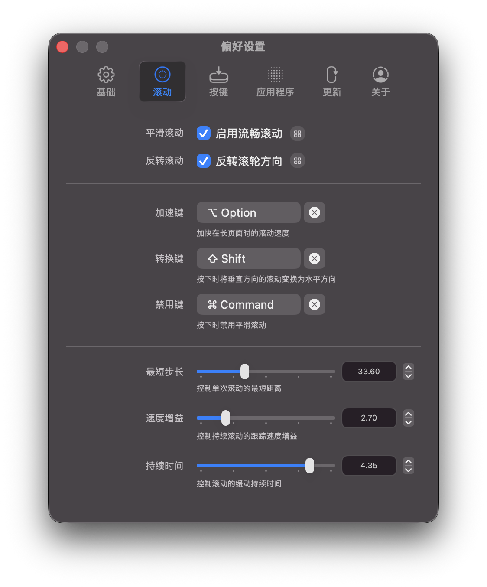
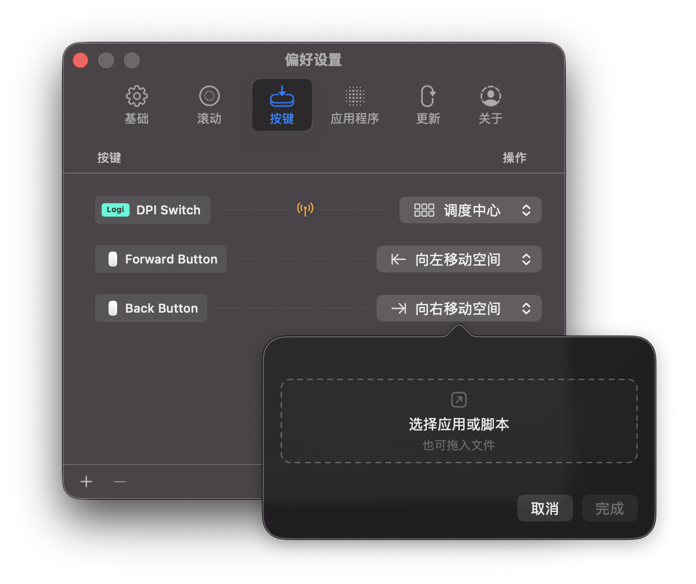
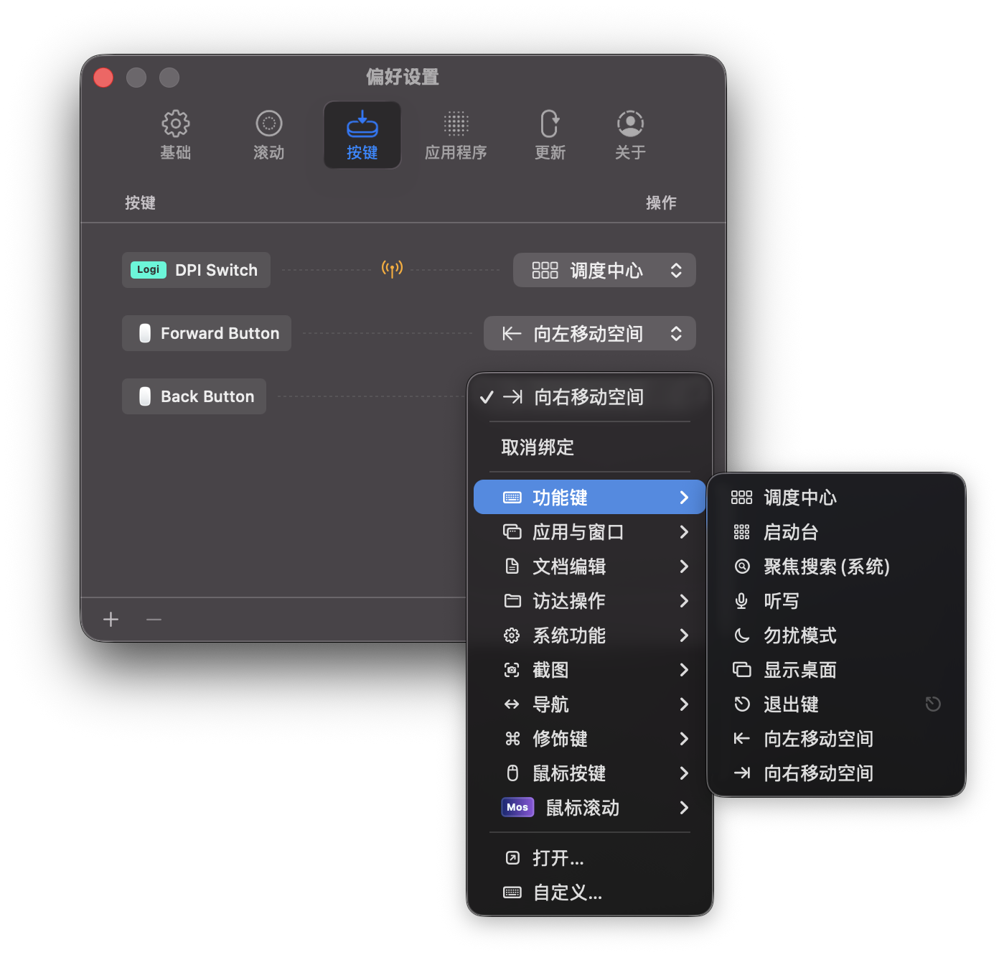

<p align="center">
  <a href="https://mos.caldis.me/">
    
  </a>
</p>

<h1 align="center">Mos</h1>

<p align="center">
  让 macOS 上的鼠标滚轮和触控板一样顺滑，同时保留鼠标该有的精准控制。
</p>

<p align="center">
  <a href="https://github.com/Caldis/Mos/releases"></a>
  
  
  <a href="LICENSE"></a>
</p>

<p align="center">
  <a href="README.md">中文</a> ·
  <a href="README.enUS.md">English</a> ·
  <a href="README.de.md">Deutsch</a> ·
  <a href="README.ja.md">日本語</a> ·
  <a href="README.ko.md">한국어</a> ·
  <a href="README.ru.md">Русский</a> ·
  <a href="README.id.md">Bahasa Indonesia</a>
</p>

<p align="center">
  <a href="https://mos.caldis.me/">官网</a> ·
  <a href="https://github.com/Caldis/Mos/releases">下载</a> ·
  <a href="https://github.com/Caldis/Mos/wiki">Wiki</a> ·
  <a href="https://github.com/Caldis/Mos/discussions">Discussions</a>
</p>

<p align="center">
  
</p>

## 为什么是 Mos

普通滚轮在 macOS 上常常显得生硬, 这是由于滚轮的精度不足导致的。Mos 会接管鼠标滚轮事件，将滚动行为插值转换成更顺滑的滚动，同时保留每个应用、每个方向、每颗按键的控制权。

同时, 你还可以使用 Mos 对任意鼠标按键进行重新映射或改写, 以适配你的工作流。

Mos 是免费的开源菜单栏工具，支持 macOS 10.13 及以上版本。

## 功能亮点

- **平滑滚动**：自定义最短步长、速度增益和持续时间，也可以启用模拟触控板模式。
- **轴向独立**：垂直/水平滚动可以分别设置平滑和反向。
- **滚动功能键**：为加速、方向转换、禁用平滑滚动绑定任意自定义按键。
- **按应用配置**：每个 App 可以继承全局设置，也可以单独覆盖滚动、快捷键和按钮绑定规则。
- **按钮绑定**：录制鼠标、键盘或自定义事件，绑定到系统动作、快捷键、打开 App、运行脚本或打开文件。
- **动作库**：内置调度中心、空间切换、截图、访达操作、文档编辑、鼠标滚动等常用动作。
- **Logi/HID++ 支持**：支持 Bolt、Unifying 接收器和蓝牙直连设备上的 Logitech 按钮事件，并可处理 Logi 专有动作。

## 截图

| 滚动调节 | 按应用配置 |
| --- | --- |
|  |  |

| 打开 App、脚本或文件 | 快捷动作菜单 |
| --- | --- |
|  |  |

## 下载与安装

### 手动安装

从 [GitHub Releases](https://github.com/Caldis/Mos/releases) 下载最新版本，解压后将 `Mos.app` 放入 `/Applications`。

首次启动时，macOS 可能会要求你授予 Mos 辅助功能权限。Mos 需要这项权限读取和重写滚动事件；如果授权后仍无法工作，可以参考 [Wiki 中的权限排查](https://github.com/Caldis/Mos/wiki/%E5%A6%82%E6%9E%9C%E5%BA%94%E7%94%A8%E6%97%A0%E6%B3%95%E6%AD%A3%E5%B8%B8%E8%BF%90%E8%A1%8C)。

### Homebrew

如果你习惯用 Homebrew 管理应用：

```bash
brew install --cask mos
```

更新：

```bash
brew update
brew upgrade --cask mos
```

## 贡献

Mos 是一个会处理系统输入、辅助功能权限、Logi/HID 设备和用户持久化配置的小工具。维护成本和回归风险都很真实，所以我们更欢迎小而集中的改动。

涉及 Logi/HID、辅助功能权限、签名、notarization、更新机制或真实设备测试的改动风险较高，请先在 issue 或 Discussions 中说明背景。

PR 描述中请说明变更动机、测试方式和可能影响的行为。

> 由 AI 开发的代码已经成为主流，我们理解现在大量的 PR 都经由 AI 生成 (包括我自己)。但提交者仍需要自行理解、整理并验证每一行代码的实际作用, 因为每个 PR 审查都有成本。

### 非常欢迎

- 小范围 bug 修复，并提供复现路径或验证说明。
- UI/UX 细节修补，例如布局、文案、可读性和引导流程的小改进。
- 小范围安全加固，例如更稳妥的权限状态处理、输入保护和边界检查。
- 本地化、文档和测试补充。
- 单一主题、变更行数较小、容易 review 的 PR。

### 暂不合并

- 未经讨论的大型新功能、模块或架构改造。
- 大量 AI 生成的代码重写、格式化、迁移或“顺手优化”。
- 会改变输入事件处理、权限提示、更新检查、旧用户数据读取或持久化格式的行为。
- 一次性补全大量机器翻译，尤其是无法由母语使用者校对的翻译集。

我们欢迎任何形式的贡献，有任何建议或意见您可以给我们 [提问](https://github.com/Caldis/Mos/issues)。

如果你对新增功能非常有热情，欢迎先在 [Discussions](https://github.com/Caldis/Mos/discussions) 发起讨论。

## 鸣谢

- [Charts](https://github.com/danielgindi/Charts)
- [LoginServiceKit](https://github.com/Clipy/LoginServiceKit)
- [Sparkle](https://github.com/sparkle-project/Sparkle)
- [Smoothscroll-for-websites](https://github.com/galambalazs/smoothscroll-for-websites)
- [Solaar](https://github.com/pwr-Solaar/Solaar)

## License

Copyright (c) 2017-2026 Caldis. All rights reserved.

Mos 使用 [CC BY-NC 4.0](http://creativecommons.org/licenses/by-nc/4.0/) 授权。请不要将 Mos 上传到 App Store。
